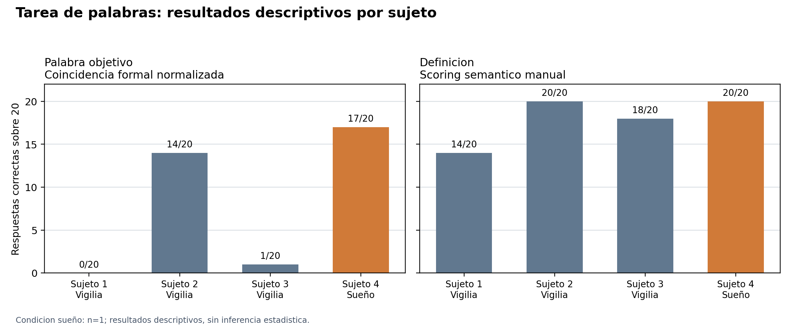

# Resultados de memoria - tarea de palabras

Fecha: 2026-06-11

## Fuente y procedencia

- Fuente: `data/PRÁCTICO LABORATORIO EQUIPO 1.xlsx`.
- Hojas leidas: cuatro sujetos, con condicion indicada en cada hoja.
- Derivados generados: este informe, CSV de detalle, CSV de resumen y figura en `outputs/figures/`.

## Metodo de scoring

- **Palabra objetivo:** coincidencia formal exacta luego de normalizar mayusculas, acentos y signos.
- **Definicion:** scoring semantico manual binario, documentado item por item en el CSV de detalle.
- El analisis es descriptivo. La condicion sueño tiene `n=1`, por lo que no corresponde inferencia estadistica fuerte.

## Tabla por sujeto

| sujeto   | condicion   |   palabra_objetivo |   definicion |   items |
|:---------|:------------|-------------------:|-------------:|--------:|
| Sujeto 1 | Vigilia     |                  0 |           14 |      20 |
| Sujeto 2 | Vigilia     |                 14 |           20 |      20 |
| Sujeto 3 | Vigilia     |                  1 |           18 |      20 |
| Sujeto 4 | Sueño       |                 17 |           20 |      20 |

## Resumen por condicion

| condicion   |   n |   palabra_objetivo_promedio |   definicion_promedio |
|:------------|----:|----------------------------:|----------------------:|
| Vigilia     |   3 |                         5.0 |                  17.3 |
| Sueño       |   1 |                        17.0 |                  20.0 |

## Figura

## Lectura prudente

- En palabra objetivo, el sujeto en condicion sueño conserva mas formas lexicales correctas que los sujetos en vigilia.
- En definicion, el rendimiento es alto en casi todos los sujetos; esto sugiere que la recuperacion semantica fue menos exigente que la recuperacion formal de pseudopalabras.
- La diferencia observada no debe atribuirse causalmente al sueño sin aclarar el tamaño muestral y el caracter descriptivo del practico.

## Archivos derivados

- `outputs/2026-06-11_resultados-memoria-detalle_v1.csv`
- `outputs/2026-06-11_resultados-memoria-resumen_v1.csv`
- `outputs/figures/2026-06-11_memoria_scores_v1.png`
